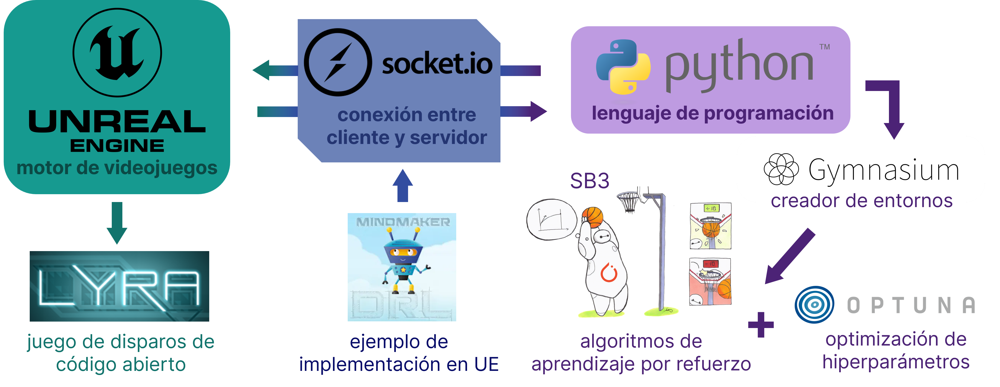

Trabajo de Fin de Grado de Fco. David Castejón Soto
===

Información del contenido
----
Este proyecto usa Lyra como base, el cual también está incluído en este repositorio.

Además del código blueprint dentro del plugin de FiringRange, el código en C++ y Python del proyecto está en la ruta:

```
Plugins/GameFeatures/FiringRange/Source
```

Información adicional
----
Para más información, consultar los archivos `manual_usuario.pdf` y `manual_codigo.pdf` en la raíz del proyecto.


